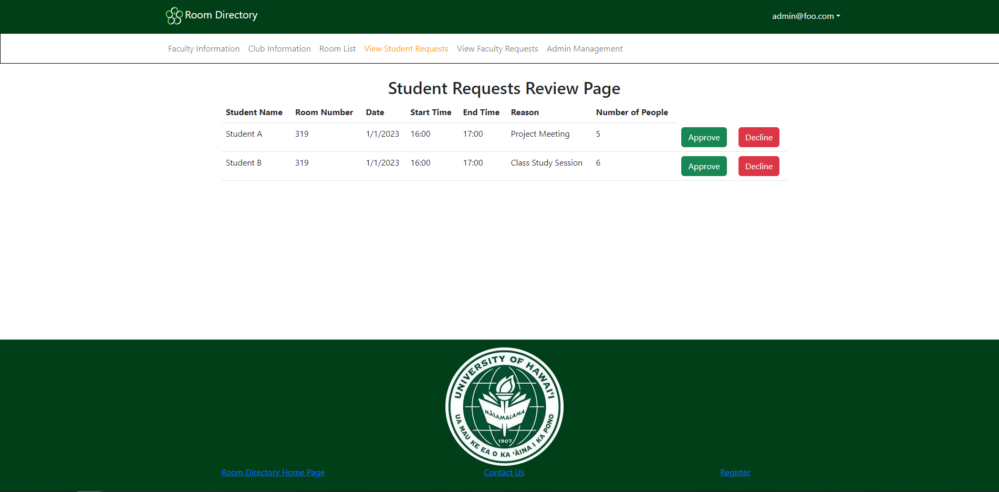
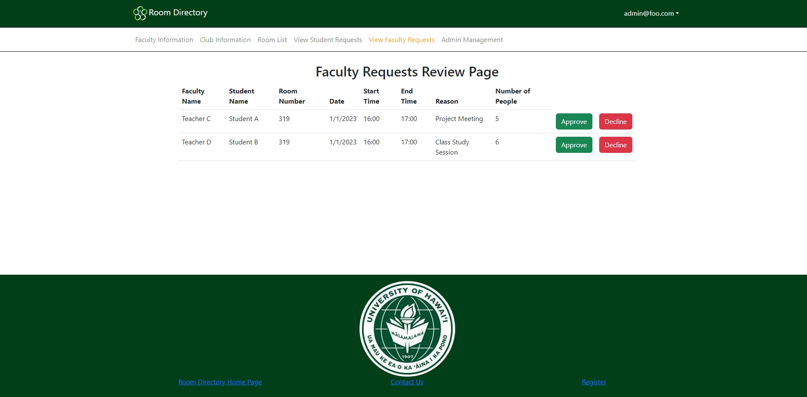
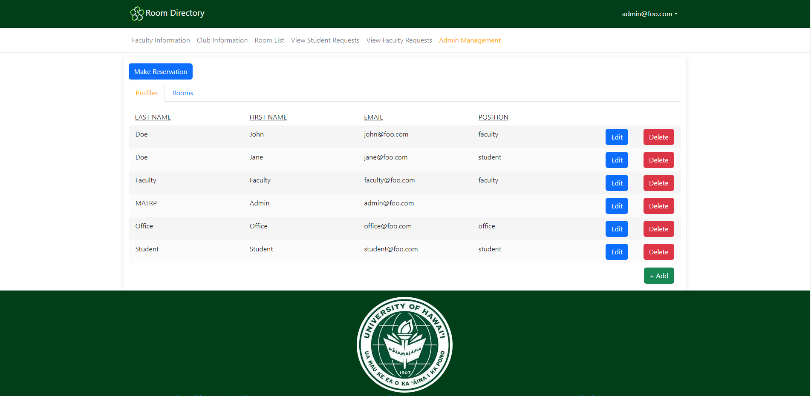
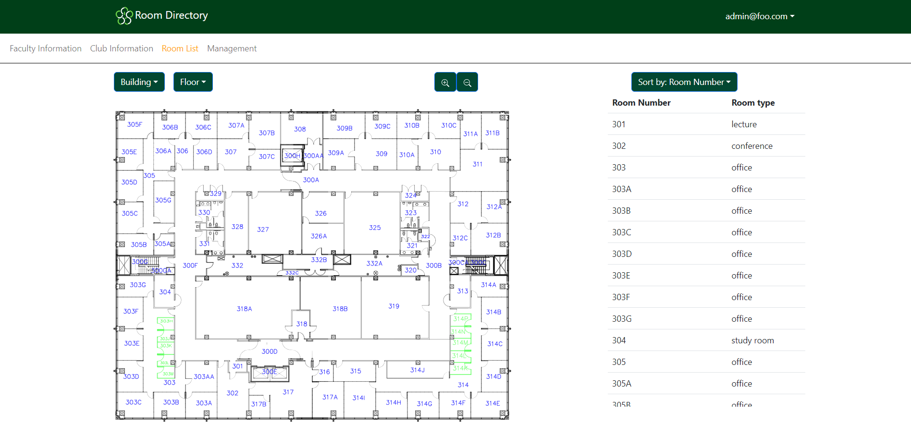
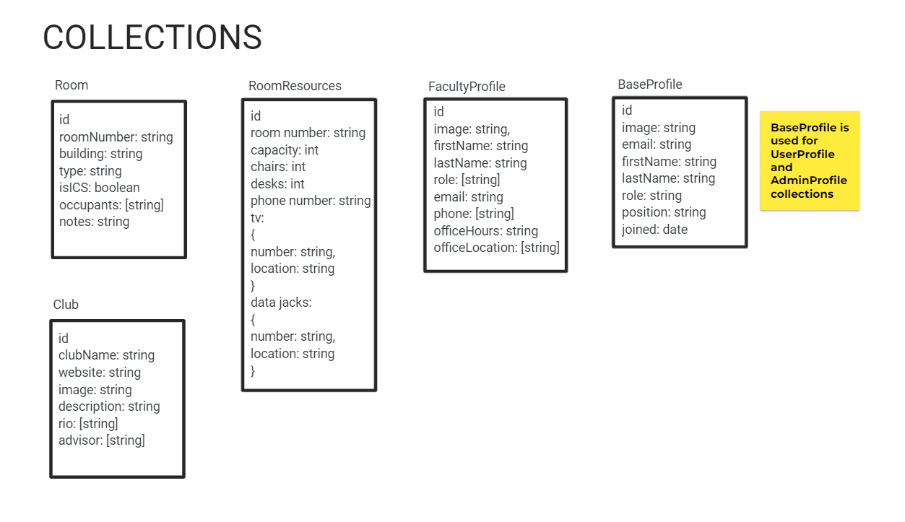

# Room Directory

## Table of contents

* [Overview](#overview)
* [User Guide](#user-guide)
* [Mockup Pages](#mockup-pages)
* [Example Workflow](#example-workflow)
* [Team](#team)

## Overview

The goal of this project is to create user friendly interface for office space management of the ICS department. Our product will service students (undergrad and graduate), TAs, RAs, faculty, support teams, and all other roles in the ICS community.

## User Guide

## Mockup Pages
#### Landing Page Mockup
<!--  -->

#### Room Reservation Page Mockup(s)

##### Room Reservation Calendar Display Mockup

##### Room Reservation Form Mockup

##### Student Requests List Page Mockup (visible to admin and faculty)
<!--  -->

##### Faculty Requests List Page Mockup (visible to admin and office)
<!--  -->

<!-- #### Footer Mockup

#### Navbar Mockup

 -->

#### Faculty Info Page Mockup
<!-- 
 -->

#### Club Info Page Mockup

#### Admin Management Page Mockup

<!-- #### Room Info Page Mockup

##### Now a modal
 -->

#### Room List Page Mockup
<!-- 
 -->

#### Profile Page Mockup
<!-- 
 -->

#### Register Page Mockup

## Example Workflow
#### For Admin User:

#### For requesting room reservations:

## Collections

## Team

Room Directory is designed, implemented, and maintained by a team consisting of nine members: 
* Cameron Arakaki
* Jingyi He
* Kayla Hirano
* Rex Lactaoen
* Michelle Leano
* Jeraldine Milla
* Timothy Ro
* Cameron Sumida 
* Trey Yasunaga

All member have signed a [team contract](https://docs.google.com/document/d/1eKRh4N_Ak8qnQbBEGrxAVlJxxvsMIjg8wWbFX2ZBQhc/edit?usp=sharing)
