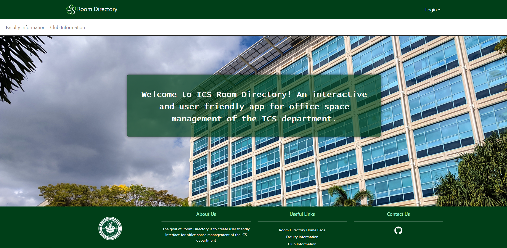
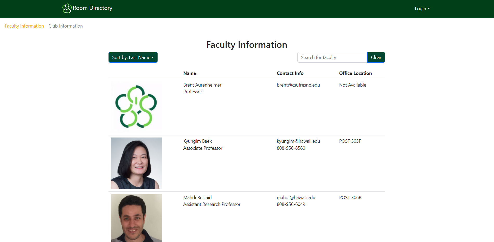
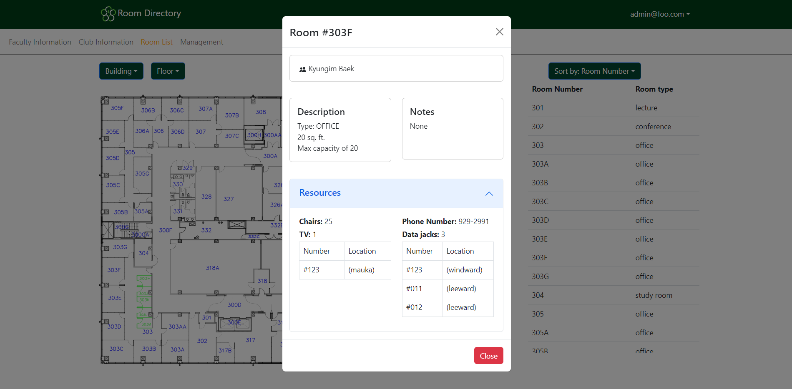
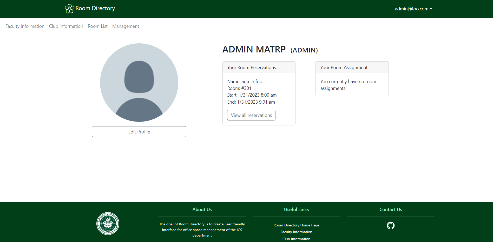
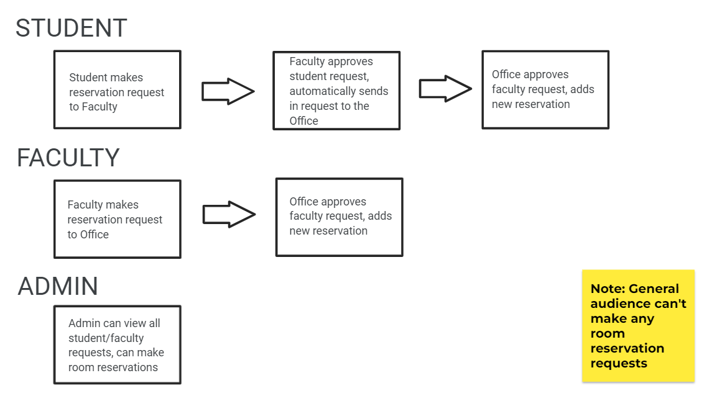

# Room Directory

## Table of contents

* [Overview](#overview)
* [User Guide](#user-guide)
* [Collections](#collections)
* [Team](#team)

## Overview

The goal of this project is to create user friendly interface for office space management of the ICS department. Our product will service students (undergrad and graduate), TAs, RAs, faculty, support teams, and all other roles in the ICS community.

## User Guide

### Landing Page

The landing page is presented to all users when they visit the top-level URL to the site.

### Faculty Info Page

The faculty info page lists the faculty in the ICS Department, and additional info such as email, phone number, and office hours. This page is accessible to all users.

### Club Info Page

The club info page lists the clubs in the ICS Department, and additional info such as the RIO students and advisors. This page is accessible to all users.

### Room List Page

The room list page shows a floor map with the available rooms. Clicking on a room in the map or from the list on the side shows additional info. This page is only accessible to signed in users. Admins or users with the "office" or "tech" title are also able to see additional room resources. 

### Management Page

The management page lets the user edit the various information in the site.

The profiles tab adds, edits, and deletes Meteor profiles. Admins or users with the "office" title are able to see this tab.

 

The faculty tab adds, edits, and deletes faculty profiles. Admins are able to see this tab.

The rooms tab adds, edits, and deletes rooms. Users can also import CSV files for bulk uploads. Admins or users with the "tech" title are able to see this tab.

The clubs tab adds, edits, and deletes clubs. Admins are able to see this tab.

### Profile Page 

The profile page is where users can edit their profile information. Users with the "faculty" role are able to change their own phone number, office location, and office hours.

### Sign Up Page 

The sign up page is where new users can create an account for the site.

<!--
## Example Workflow
### For Admin User:

### For requesting room reservations:

-->

## Collections

## Team

Room Directory is designed, implemented, and maintained by a team consisting of nine members: 
* Cameron Arakaki
* Jingyi He
* Kayla Hirano
* Rex Lactaoen
* Michelle Leano
* Jeraldine Milla
* Timothy Ro
* Cameron Sumida 
* Trey Yasunaga

All member have signed a [team contract](https://docs.google.com/document/d/1eKRh4N_Ak8qnQbBEGrxAVlJxxvsMIjg8wWbFX2ZBQhc/edit?usp=sharing)
